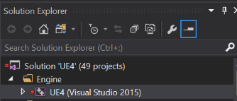

# Manual setup guide for Windows

This guide will prepare your Windows machine for local development with the SpatialOS SDK.

## 1. System requirements

SpatialOS works with up-to-date versions of Windows 7 and 10.

Before following the setup guide check that your machine meets the
[hardware requirements](../../get-started/requirements.md#hardware).

## 2. Set up the SpatialOS CLI

To set up the SpatialOS CLI (`spatial`):

1. [Download `spatial` for Windows (64bit)](https://console.improbable.io/toolbelt/download/latest/win).
By downloading `spatial`, you agree to the [SpatialOS EULA](https://auth.improbable.io/auth/v1/eula).
1. Put `spatial.exe` in a directory where you have administrator privileges.
1. Add the directory containing `spatial.exe` to your `PATH` by following [these instructions](https://www.java.com/en/download/help/path.xml).

1. Check this succeeded by running `spatial update` in your terminal. You should get the output:
    `Current version of the 'spatial' command-line tool: <version number>`
    `Attempting to download the latest version...`

## 3. Set up Unreal
> Unreal versions **4.16.3-release** and **4.17.1-release** have been tested with SpatialOS. Other versions may work fine, 
but have not been extensively tested.
To use the Unreal SDK, you **must** build the Unreal engine from source:

##### 1. Install dependencies
1. Restart your computer to complete the install process.
1. If you don't have it already, install [Visual Studio 2015](https://www.visualstudio.com/vs/older-downloads/).
1. If you don't have it already, install the
[Windows SDK 8.1](https://developer.microsoft.com/en-us/windows/downloads/windows-8-1-sdk).

##### 2. Get the Unreal Engine source
To use the Unreal SDK, you need to build the Unreal Engine 4 from source. To get the source and set it up to build:
1. Check if you have access to the [Unreal Engine 4 GitHub repository](http://github.com/EpicGames/UnrealEngine). 
If you don't, [follow these instructions to get access](https://github.com/EpicGames/Signup).
1. Clone the repository and checkout the 4.17.1-release branch by running either of these commands in a Git bash terminal:
	* via HTTPS: `git clone https://github.com/EpicGames/UnrealEngine.git -b 4.17.1-release`
	* via SSH: `git clone git@github.com:EpicGames/UnrealEngine -b 4.17.1-release`

1. Navigate to the root of the cloned repo.
1. Add a system environment variable (`Control Panel > System and Security > System > Advanced system settings > Advanced >
Environment variables`) named `UNREAL_HOME`.
The value should be the path to the directory you cloned into above. For example, `D:\Work\UnrealEngine`.

1. Restart your terminal and run `echo $env:UNREAL_HOME` (PowerShell) or `echo %UNREAL_HOME%` (cmd) to make sure that the new 
environment variable is registered. This should output the path to the directory you cloned into above. For example, `D:\Work\UnrealEngine`.

##### 3. Build the Unreal Engine

To build Unreal workers for SpatialOS deployments, you need to build targeting Linux, which requires cross-compilation
of your SpatialOS project and Unreal Engine.

> Building Unreal Engine from source could take up to **a few hours**. Just so you know!

1. Follow the compiling for Linux [setup guide](https://wiki.unrealengine.com/Compiling_For_Linux) for UnrealEngine 4.17.1, 
installing the Linux-x86_64 cross compile toolchain. You don't need to follow the "Packaging for Linux" section.
1. After following the Linux setup instructions, restart your terminal and run:
    * `echo $env:LINUX_MULTIARCH_ROOT` (PowerShell) 
    * `echo %LINUX_MULTIARCH_ROOT%` (cmd) 
    * `echo $LINUX_MULTIARCH_ROOT`(Git Bash)

	to make sure that the new environment variable is registered. This should output the path to the clang directory that you 
	installed in the previous step.
1. Navigate to the directory you cloned the Unreal Engine source code into. For example, `D:\Work\UnrealEngine`.
1. In this folder, run the batch file `Setup.bat`. 
This will install prerequisites for building Unreal Engine 4.
1. While running the batch file, you should see `Checking dependencies (excluding Mac, Android)...`. If it says `excluding Linux` too, 
make sure that you set the environment variable `LINUX_MULTIARCH_ROOT` correctly, and run the batch file again.
1. In the same directory, run the batch file `GenerateProjectFiles.bat`.
This sets up the project files required to build Unreal Engine 4.
If you encounter an `error MSB4036: The "GetReferenceNearestTargetFrameworkTask" task was not found` when building with VS2017, 
check that you have NuGet Package Manager installed via the Visual Studio installer.
1. Open `UE4.sln` in Visual Studio 2015.
1. In the `Build > Configuration Manager` window, set your solution configuration to `Development Editor` and your solution platform to `Win64`.
1. In the Solution Explorer, right-click on the UE4 target and select `Build` (you may be prompted to install some dependencies first).

This builds Unreal Engine, which can take up to a couple of hours.

1. Once the build succeeds, search for the `Automation Tool` project in the solution explorer, right-click it and click `Build`.
You have now built UnrealEngine 4 for cross-compilation for Linux.

> Once you've built the Unreal Engine, *don't move it into another directory*: that will break the integration.

## 4. (optional) Install the launcher

If you want to run a game client to connect to a SpatialOS game running in the cloud, you must install the
[Launcher (SpatialOS documentation)](https://docs.improbable.io/reference/13.0/shared/glossary#launcher).
1. [Download the Launcher](https://console.improbable.io/launcher/download/stable/latest/win).
2. Follow the instructions in the installation wizard.

## 5. Next steps
You've now set up your machine for development with SpatialOS!
